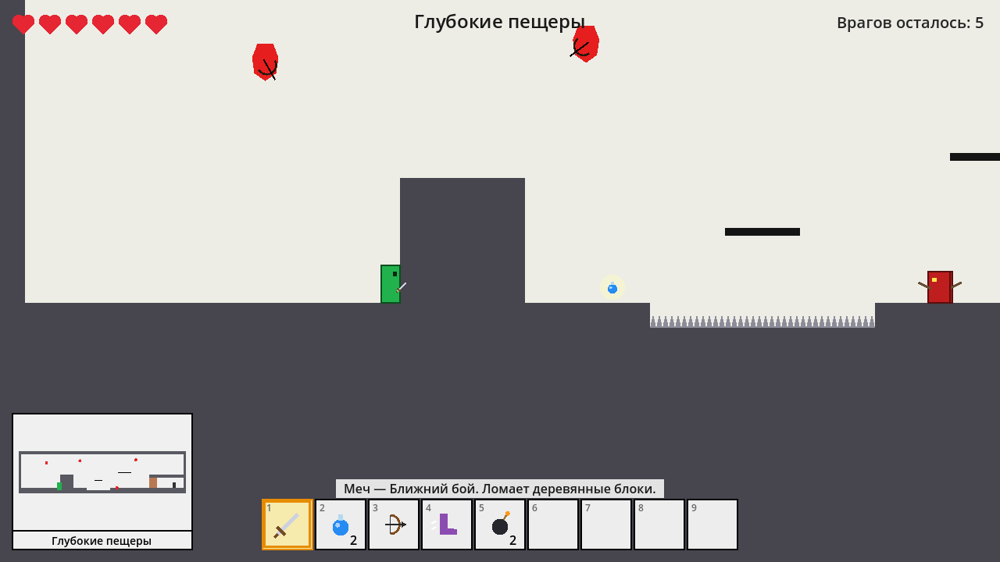
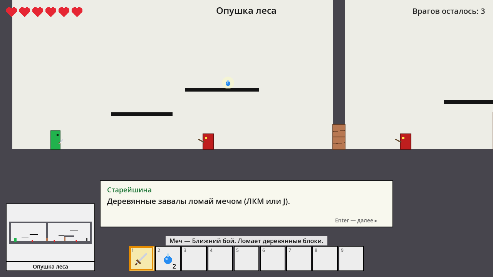

# Зелёный странник

2D сюжетный платформер на **Godot 4.7** (совместим с 4.3+) (GDScript). Игрок зачищает локации, за каждую получает новый предмет со своей способностью, открывает новые места на общей карте и продвигает сюжет.




## Как запустить
1. Установи [Godot 4.3+](https://godotengine.org/download) (обычную версию, не .NET).
2. В Project Manager нажми **Import** и выбери `mgameyes/project.godot`.
3. Нажми **F5**.

## Управление
| Клавиша | Действие |
|---|---|
| A / D, ← / → | ходьба |
| Пробел / W | прыжок (с сапогами — двойной) |
| ЛКМ / J | использовать выбранный предмет (целься мышью) |
| 1–9, колёсико | выбор ячейки хотбара |
| Enter / E | листать диалог |
| Esc | пауза |

## Что уже есть
- **Игрок** (зелёный): движение, прыжок, урон, неуязвимость после удара.
- **Враги** (красные): пехотинец ходит по земле и бежит к игроку; лучник летает и стреляет.
- **Ломаемые блоки** (коричневые): ломаются мечом или бомбой, стрелами — нет.
- **Хотбар** снизу и **миникарта** слева снизу, как на концепте.
- **Предметы**: меч, лук, зелье, бомба, сапоги прыгуна (двойной прыжок), сердце леса (+2 к здоровью).
- **3 локации**: Опушка леса → Сторожевая башня → Глубокие пещеры. Каждая следующая требует предмет из предыдущей.
- **Карта мира**, сюжетные диалоги, автосохранение (`user://save.json`).

## Структура
```
mgameyes/               папка проекта Godot
  scenes/                 main_menu, world_map, level (корневые узлы, остальное создаётся кодом)
  scripts/autoload/       game_state.gd — инвентарь, прогресс, сохранение, управление
  scripts/data/           items.gd — предметы; locations.gd — локации, сюжет, карты уровней
  scripts/level/          игрок, враги, блоки, снаряды, подбираемые предметы, выход
  scripts/ui/             HUD, хотбар, миникарта, диалоги, меню, карта мира
```

## Как расширять
**Новая локация.** Добавь блок в `mgameyes/scripts/data/locations.gd` и её id в `ORDER`. Уровень рисуется символами:
`#` стена, `=` платформа, `B` ломаемый блок, `^` шипы, `P` старт, `X` выход, `W` пехотинец, `A` лучник, `h` зелье, `o` бомба.

**Новый предмет.** Добавь его в `mgameyes/scripts/data/items.gd` (название, описание, иконка в `draw_icon`), а действие — в `_use_selected_item()` в `mgameyes/scripts/level/player.gd`.

**Своя графика.** Сейчас всё рисуется кодом (функции `_draw`). Спрайты можно подключить позже, заменив `_draw` на `Sprite2D` или `AnimatedSprite2D`.
