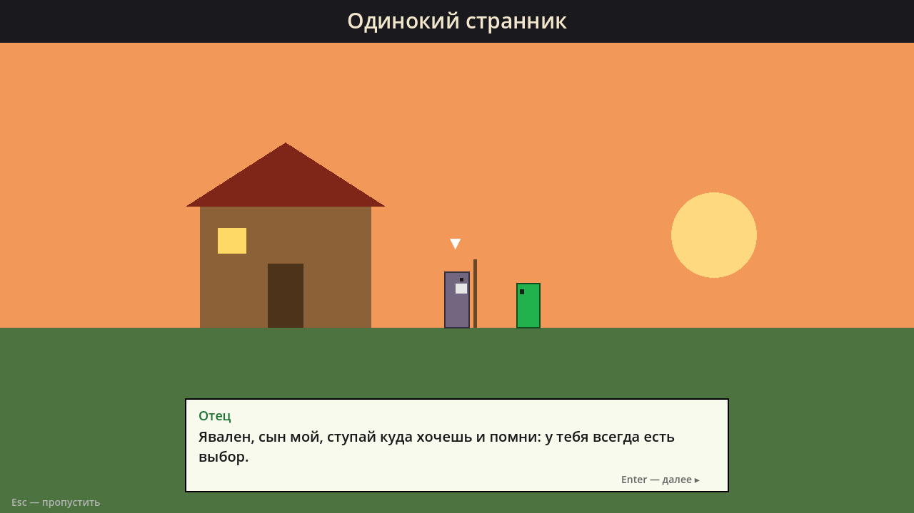

# Три царства

2D сюжетный платформер на **Godot 4.7** (совместим с 4.3+, GDScript). Выбираешь кампанию, проходишь локации на карте трёх царств, получаешь предметы со своими способностями и принимаешь решения, которые меняют историю.




## Как запустить
1. Установи [Godot 4.3+](https://godotengine.org/download) (обычную версию, не .NET).
2. В Project Manager нажми **Import** и выбери `mgameyes/project.godot`.
3. Нажми **F5**. Управление и правила написаны в главном меню.

## Кампания «Одинокий странник»
Отец провожает Явалена из рода Эрин: «у тебя всегда есть выбор». На карте трёх царств — эльфы, люди и скрытое пеленой третье царство.

| # | Локация | Царство | Что там | Награда |
|---|---|---|---|---|
| 1 | Деревня Брод | люди | кузнец, меч | меч |
| 2 | Королевский тракт | люди | эльфы-разведчики и лучники | лук разведчика |
| 3 | Лес Серебряных крон | эльфы | эльфы; **выбор**: пощадить или добить капитана | эльфийские сапоги (двойной прыжок) |
| 4 | Разлом | люди | первые демоны; раскрывается навык **Кровь рода Эрин** | Сердце Разлома (+30 HP) |
| 5 | Пепельные врата | демоны | босс — Страж врат | концовка |

Концовка зависит от выбора в эльфийском лесу.

**Навык «Кровь рода Эрин»** — двойной урон по демонам. Он работает с самого начала, но в интерфейсе показан как «???», пока герой не ударит первого демона.

## Структура
```
mgameyes/                 папка проекта Godot
  scenes/                 main_menu, cutscene, world_map, level
  scripts/autoload/       game_state.gd — кампания, инвентарь, навыки, флаги выбора, сохранение
  scripts/data/           campaigns.gd — сюжет, катсцены, локации, карты уровней
                          items.gd — предметы; skills.gd — навыки
  scripts/level/          игрок, враги (эльфы, демоны, босс), житель, блоки, снаряды
  scripts/ui/             меню, катсцена, карта трёх царств, HUD, хотбар, миникарта, диалоги
```

## Как расширять
**Новая кампания.** Добавь её в `CAMPAIGNS` и `CAMPAIGN_ORDER` в `mgameyes/scripts/data/campaigns.gd` и поставь `"available": true`.

**Новая локация.** Добавь блок в `locations` нужной кампании и её id в `order`. Уровень рисуется символами:
`#` стена, `=` платформа, `B` ломаемый блок, `^` шипы, `P` старт, `X` выход, `N` житель, `e` эльф-разведчик, `a` эльф-лучник, `W` демон, `A` летающий демон, `D` босс, `h` зелье, `o` бомба, `s` меч.

**Диалоги с выбором.** Реплика `{"who": ..., "text": ..., "choices": [["Текст", "флаг"], ...]}` ставит флаг; реплики с `"if": "флаг"` / `"unless": "флаг"` показываются только при нужном выборе.

**Новый предмет** — `items.gd` + действие в `_use_selected_item()` в `player.gd`. **Новый навык** — `skills.gd` + эффект в `GameState.player_hit()`.
