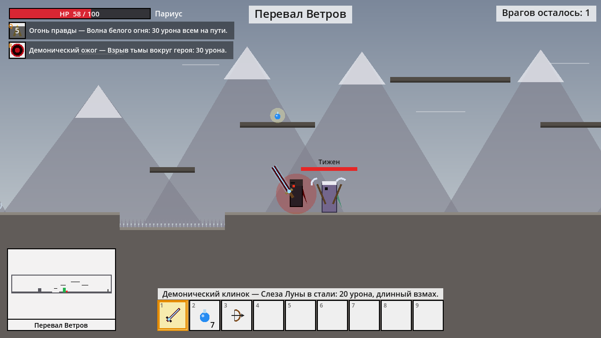
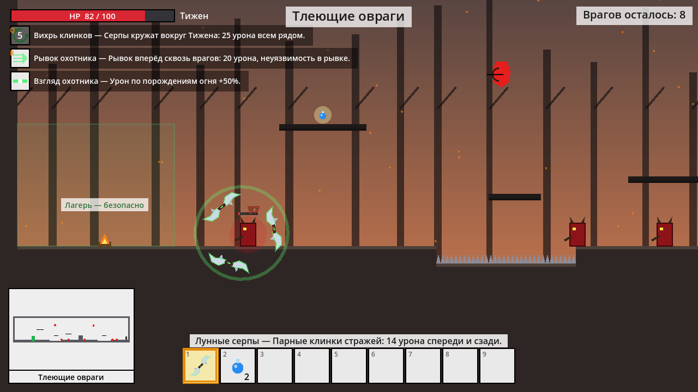

# Три царства

2D сюжетный платформер на **Godot 4.7** (совместим с 4.3+, GDScript). Две связанные кампании, тематические уровни (лес, водосток, город эльфов, руины), катсцены, герои со своими навыками.





## Как запустить
1. Установи [Godot 4.3+](https://godotengine.org/download) (обычную версию, не .NET).
2. В Project Manager нажми **Import** и выбери `mgameyes/project.godot`.
3. Нажми **F5**. Управление и правила написаны в главном меню.

## Кампания 1 — «Одинокий странник» (Явален)
Сюжет линейный: Явален идёт в Царство эльфов вернуть пленников и пытается спасти всех на своём пути.

| # | Локация | Тема | Что происходит | Награда |
|---|---|---|---|---|
| 1 | Деревня Брод | деревня | кузнец Горан даёт меч | меч |
| 2 | Горящие поля | закат, дым | спасает крестьян | 2 зелья |
| 3 | Королевский тракт | дорога | эльфы-разведчики; раненый эльф отдаёт лук | лук |
| 4 | Опушка Серебряного леса | лес | лучники в кронах | 3 бомбы |
| 5 | Сожжённая роща | пепелище | порождения огня, спасает эльфят, раскрывается **Кровь рода Эрин**; катсцена: встреча с чёрным воином, побег в реку | Сердце (+30 HP) |
| 6 | Лагерь Лиаэль | эльфийский лагерь | **босс Лиаэль** (длинные волосы); после боя остаётся на коленях, Явален её щадит | эльфийские сапоги |
| 7 | Тропа к Иллариону | лес | высокие уступы, двойной прыжок | 3 зелья |
| 8 | Водосток Иллариона | канализация | нечистоты, крысы, низкие потолки | амулет лекаря |
| 9 | Глубины водостока | канализация | ржавые решётки, бомбы | 2 зелья |
| 10 | Темница Иллариона | подземелье | освобождает пленников; старик Орвин решает рассказать историю Париуса | — |

## Кампания 2 — «Чёрная участь» (Париус)
Десять лет назад. Париус — жестокий, но честный командир людей.

| # | Локация | Что происходит |
|---|---|---|
| 1 | Пограничный форт | оборона форта вместе с другом Дисом |
| 2 | Речная переправа | бой у реки |
| 3 | Серебряный лес | лучники эльфов |
| 4 | Стены Иллариона | подъём по белой стене |
| 5 | Тронный зал | катсцена: маг со Слезой Луны убивает Диса; Париус запирается в себе; «прошло десять лет» |
| 6 | Древний Оскал | каменные стражи в руинах-челюсти |
| 7 | Пасть Пегруса | **босс Страж Оскала**; катсцена: артефакт древнего бога Пегруса, демоническая сила |
| 8 | Тлеющая чаща | Париус жжёт эльфийский лес |
| 9 | Сердце Серебряного леса | **бой с Явалeном** (у него Щит рода); катсцена: Париус хочет добить его, но Явален сбегает в реку |
| 10 | Улицы Иллариона | второй поход на эльфийский трон, ночной город |
| 11 | Лунный престол | **босс Верховный маг** (телепорты, веера лунных сфер); катсцена: Слеза Луны впитывается в клинок — **Демонический клинок** (20 урона, длинный взмах) |
| 12 | Следы мальчишки | поиски Явалена; **помехи** — Париус слышит голос Диса и отмахивается от него |
| 13 | Перевал Ветров | **босс Тижен с двумя глефами** (вихрь, бросок глефы); почти погибает, но уходит живым |
| 14 | Северные льды | ледяные духи, голос Диса всё тише |
| 15 | Ледяной алтарь | катсцена: Пегрус овладевает телом Париуса, душа угасает. Конец кампании |

## Кампания 3 — «Клинки изгнанника» (Тижен)
Тижен — эльф, страж Слезы Луны, с повязкой на глазах и парными клинками-серпами. Изгнан за то, что выступил против использования Слезы как оружия.

| # | Локация | Что происходит |
|---|---|---|
| — | Пролог (катсцена) | 10 лет назад: маг Слезой Луны убивает Диса, Тижен протестует, совет изгоняет его — он забирает Лунные серпы |
| 1 | Изгнание из Иллариона | прорыв через стражу; «прошло десять лет», просыпается Пегрус |
| 2 | Тлеющие овраги | охота на порождения огня |
| 3 | Речной берег | находит раненого Явалена после боя с Париусом |
| 4 | Хижина травницы | защита Явалена; травница рассказывает о крови Эрин |
| 5 | Перевал Ветров | **босс Париус** с Демоническим клинком; на 35% катсцена — Тижен обрушивает скалу и уходит |
| 6 | Северная тропа | погоня за Париусом; голос Париуса из льда |
| 7 | Ледяной алтарь | **босс Пегрус в теле Париуса**; на 50% уходит в метель, пелена над востоком спадает |
| 8 | Встреча у костра | Тижен, Явален и Орвин — завязка «Пепельного трона» |

## Навыки
| Навык | Герой | Клавиша | Эффект | Перезарядка |
|---|---|---|---|---|
| Щит рода | Явален | Q | купол света на 2.5 с, блокирует любой урон | 10 с |
| Кровь рода Эрин | Явален | пассивный, скрыт до сюжета | ×2 урон по порождениям огня | — |
| Вихрь клинков | Тижен | Q | серпы кружат вокруг, 25 урона | 5 с |
| Рывок охотника | Тижен | R | рывок сквозь врагов, 20 урона, неуязвимость | 6 с |
| Взгляд охотника | Тижен | пассивный | +50% урона по порождениям огня | — |
| Огонь правды | Париус | Q | волна огня, 30 урона всем на пути | 6 с |
| Демонический ожог | Париус (после Пегруса) | R | взрыв вокруг героя, 30 урона | 8 с |

Пока открыт диалог, игра стоит на паузе. У точки старта каждого уровня — безопасный лагерь.

## Структура
```
mgameyes/                 папка проекта Godot
  scenes/                 main_menu, cutscene, world_map, level
  scripts/autoload/       game_state.gd — кампания, инвентарь, навыки, флаги выбора, сохранение
  scripts/data/           campaigns.gd — сюжет, катсцены, локации, карты уровней
                          items.gd — предметы; skills.gd — навыки
  scripts/level/          игрок, враги (эльфы, демоны, босс), житель, блоки, снаряды
  scripts/ui/             меню, катсцена, карта трёх царств, HUD, хотбар, миникарта, диалоги
```

## Как расширять
**Новая кампания.** Добавь её в `CAMPAIGNS` и `CAMPAIGN_ORDER` в `mgameyes/scripts/data/campaigns.gd` и поставь `"available": true`.

**Новая локация.** Добавь блок в `locations` нужной кампании и её id в `order`. Уровень рисуется символами:
`#` стена, `=` платформа, `B` ломаемый блок, `^` шипы, `~` вода/нечистоты, `P` старт, `X` выход, `N` житель, `e` эльф, `a` эльф-лучник, `m` эльф-маг, `r` крыса, `G` каменный страж, `W`/`A` порождения огня, `L` Лиаэль, `Y` Явален, `M` Страж Оскала, `Z` Верховный маг, `T` Тижен, `f` ледяной дух, `K` Париус, `Q` Пегрус, `h` зелье, `o` бомба, `s` меч. Поле `theme` задаёт оформление уровня.

**Диалоги с выбором (сейчас в кампаниях не используются).** Реплика `{"who": ..., "text": ..., "choices": [["Текст", "флаг"], ...]}` ставит флаг; реплики с `"if": "флаг"` / `"unless": "флаг"` показываются только при нужном выборе.

**Новый предмет** — `items.gd` + действие в `_use_selected_item()` в `player.gd`. **Новый навык** — `skills.gd` + эффект в `GameState.player_hit()`.
